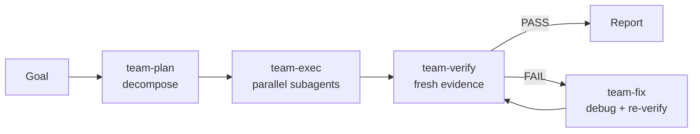

<div align="center">

# oh-my-kiro

Parallel subagent team executor for Kiro — plan, execute, verify, and fix with coordinated worker agents.

[](https://github.com/oniharnantyo/oh-my-kiro/blob/main/LICENSE)
[](https://github.com/oniharnantyo/oh-my-kiro/stargazers)
[](https://kiro.dev/docs/powers/)
[](https://agent-plugins.org/)

</div>

## What is this?

oh-my-kiro is a [Kiro power](https://kiro.dev/docs/powers/) that fans one goal out across planner / executor / debugger / verifier / critic workers on a shared task list. A `setup` skill installs the worker agents, team-state hooks, and a Bash safety guard into your Kiro scope; the `team` skill then runs the pipeline **team-plan → team-exec → team-verify → team-fix (loop)**.

Inspired by [oh-my-claudecode](https://github.com/Yeachan-Heo/oh-my-claudecode). Built on the [Agent Plugins](https://agent-plugins.org/) v1.0.0 specification. See [Credits](#credits).

## Quick Start

**1. Install the power** — pick one:

```text
# IDE — from GitHub (no download needed)
Powers panel → Add Custom Power → Import power from GitHub
→ https://github.com/oniharnantyo/oh-my-kiro
```

```bash
# CLI V3 — one line, no clone required
curl -fsSL https://raw.githubusercontent.com/oniharnantyo/oh-my-kiro/main/install.sh | bash
```

<details>
<summary>Other CLI options</summary>

```bash
# From a local checkout (if you already cloned it)
./install.sh

# Pin a version
./install.sh --ref v0.1.0

# Raw CLI, from a local directory
/powers install .
```

`install.sh` downloads the power tarball to a temp directory and runs
`kiro-cli --v3 powers install .` there — no git needed.

</details>

```text
# 2. Run setup — required. Asks your scope and cost preset, then installs.
/setup

# 3. Run a team
/team fix all TypeScript errors
```

**Setup is mandatory** — the team skill dispatches installed worker agents by name. Run it once per machine with **global** scope, or once per project with **project** scope:

| Scope | Setup runs | Why |
| --- | --- | --- |
| **Project** (`.kiro/`) | Once per project | Agents are created inside that project's `.kiro/agents/` — every new project needs setup again |
| **Global** (`~/.kiro/`) | Once per machine | Agents live in `~/.kiro/agents/` and serve every project |

## How it works



### Setup installs the payload

The `setup` skill detects whether the power is project-installed (then uses project scope without asking), otherwise asks **project** (`.kiro/`) or **global** (`~/.kiro/`). It then asks which **cost preset** the team should use:

| Preset | low (`executor-low`) | medium (`planner`, `verifier`, `executor-medium`) | high (`executor-high`, `debugger`, `critic`) |
| --- | --- | --- | --- |
| **cheap** | `qwen3-coder-next` (0.05x) | `minimax-m2.5` (0.25x) | `glm-5` (0.5x) |
| **medium** (default) | `minimax-m2.5` (0.25x) | `claude-haiku-4.5` (0.4x) | `claude-sonnet-5.5` (1.3x) |
| **premium** | `claude-haiku-4.5` (0.4x) | `claude-sonnet-5.5` (1.3x) | `claude-opus-5.5` (2.0x) |
| **openai** | `gpt-5.6-luna` (0.6x) | `gpt-5.6-terra` (2.2x) | `gpt-5.6-terra` (2.2x) |

- **cheap** — open-weight models throughout; best for high-volume or cost-sensitive runs.
- **medium** — balanced (default): cheap for trivial work, Haiku for scoped work, Sonnet 5.5 for structural work.
- **premium** — Haiku as the floor, Sonnet 5.5 for scoped work, Opus 5.5 for structural work.
- **openai** — GPT-5.6 models throughout (Luna for light work, Terra for the rest).

Custom mixes are possible with per-tier overrides (`--model-low`, `--model-medium`, `--model-high`).

It then dry-runs and installs the payload — 7 worker agents (each injected with its preset model), `steering/team.md`, and the hooks — rewriting hook script paths per scope.

Without a preset flag, the installer defaults to **medium**: `executor-low` → `minimax-m2.5`; `planner`, `verifier`, `executor-medium` → `claude-haiku-4.5`; `executor-high`, `debugger`, `critic` → `claude-sonnet-5.5`.

> **Reasoning effort is not an agent setting.** Kiro's agent config has no effort field — effort is configured per session (`/effort`, `--effort`) or per model in settings (`chat.modelDefaults` in `~/.kiro/settings/cli.json`). See [Reasoning effort](https://kiro.dev/docs/models/effort.md).

### Dispatch

The lead dispatches installed worker agents (`planner`, `executor-medium`, `debugger`, `verifier`, `critic`, …) by name — Kiro runs them as parallel subagents, each with its own tools, model, and pre-approved permissions. Every worker ends with `STATUS: DONE` or `STATUS: BLOCKED`. Verification is a separate `verifier` pass that never self-approves, and the fix loop is capped at 3 iterations. State lives in `.team/state.json` (goal + task list) and `.team/log.md` (dispatch ledger) — add `.team/` to `.gitignore`.

### Team-state hooks

Installed by setup. They only act while a team run is active (`.team/state.json` with `"status": "active"`), never block the session (exit 0), and need `python3` on PATH.

| Trigger | Team support |
| --- | --- |
| `SessionStart` | Injects goal + progress so a restarted session resumes instead of re-planning |
| `UserPromptSubmit` | Same reminder mid-session, with open task IDs |
| `PreToolUse` (subagent tools) | Appends `DISPATCH <worker> — <task>` to `.team/log.md` |
| `PostToolUse` (subagent tools) | Appends `COMPLETE <worker> — <STATUS>` to `.team/log.md` |
| `Stop` | Appends a session-end line; nudges when the run ended with open tasks |

### Bash guard

`PreToolUse` on shell tools blocks clearly destructive commands: recursive/forced `rm` at `/` or `~`, `git push --force`, shutdown/reboot, `mkfs`/`dd of=/dev/`, SQL `DROP`, `chmod -R 777 /`, history wipes. Exit 2 + stderr reason. The denylist is intentionally conservative — a missed exotic beats a false positive. Set `"enabled": false` on the hook to disable.

> The upstream plugin's `PermissionRequest` auto-approval has no Kiro equivalent and is not ported.

## Project Structure

```text
oh-my-kiro/
├── agents/                  # payload — installed by setup
│   ├── critic.md
│   ├── debugger.md
│   ├── executor-high.md
│   ├── executor-low.md
│   ├── executor-medium.md
│   ├── planner.md
│   └── verifier.md
├── hooks/                   # payload — installed by setup
│   ├── scripts/
│   │   ├── guard_hook.py
│   │   └── team_hook.py
│   ├── bash-guard.json
│   └── team-state.json
├── skills/
│   ├── setup/
│   │   ├── scripts/
│   │   │   └── install.py
│   │   └── SKILL.md
│   └── team/
│       └── SKILL.md
├── steering/                # payload — installed by setup
│   └── team.md
├── LICENSE
├── README.md
├── install.sh
└── plugin.json
```

## Documentation

| Resource | Description |
| --- | --- |
| [`skills/setup/SKILL.md`](skills/setup/SKILL.md) | Setup skill — scope + cost-preset questions, install flow |
| [`skills/team/SKILL.md`](skills/team/SKILL.md) | Team skill — pipeline phases, dispatch modes, inlined role prompts |
| [`plugin.json`](plugin.json) | Power manifest — identity and activation keywords |
| [`install.sh`](install.sh) | CLI installer — downloads the tarball and runs `kiro-cli --v3 powers install` |
| [`hooks/team-state.json`](hooks/team-state.json) | Team-state hook wiring |
| [`hooks/bash-guard.json`](hooks/bash-guard.json) | Destructive-command guard |
| [`LICENSE`](LICENSE) | MIT |

**Activation keywords:** `team of subagents`, `parallel subagents`, `subagent team`, `parallel agents`, `multi-agent orchestration`, `worker agents`, `oh-my-kiro`.

## Contributing

Issues and pull requests are welcome — open one at [github.com/oniharnantyo/oh-my-kiro](https://github.com/oniharnantyo/oh-my-kiro/issues).

<a href="https://github.com/oniharnantyo/oh-my-kiro/graphs/contributors">
  
</a>

## Credits

This project is a port, not an original design. It stands on the work of:

- **[oh-my-claudecode](https://github.com/Yeachan-Heo/oh-my-claudecode)** (MIT) — the original team-skill concept this project is inspired by: the parallel worker pipeline (plan → exec → verify → fix), the planner / executor / debugger / verifier / critic roles, and the shared task-list protocol all originate there.

The Kiro-specific layer added here: the power packaging (`plugin.json`), the `setup` skill that installs agents and hooks into a Kiro scope, the cost presets (cheap/medium/premium/openai), and the port of the hooks to Kiro's `.kiro/hooks/` format.

## License

MIT — see [LICENSE](LICENSE).

---

<div align="center">

[](https://star-history.com/#oniharnantyo/oh-my-kiro&Date)

</div>
